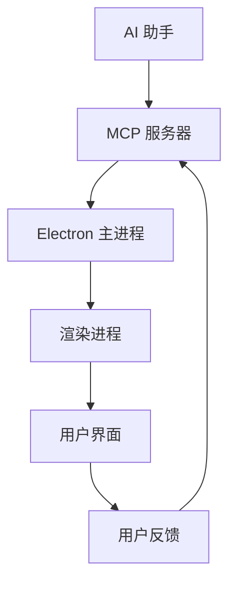

# 交互式反馈 MCP

一个强大的 MCP (Model Context Protocol) 插件，为 AI 助手提供交互式反馈收集功能。基于 JavaScript/TypeScript 开发，使用 Electron 构建跨平台桌面应用，让 AI 助手能够实时获取用户反馈和执行命令。

## ✨ 核心特性

🖥️ **跨平台支持** - 支持 Windows、macOS、Linux 三大平台  
🎨 **现代化界面** - 精美的暗色主题，符合开发者习惯  
⚡ **实时命令执行** - 在界面中直接运行命令并查看输出  
💬 **智能反馈收集** - 为 AI 助手提供结构化的用户反馈  
💾 **设置持久化** - 自动保存每个项目的配置和偏好  
📦 **一键安装** - 通过 npm/npx 快速部署，无需复杂配置

## 🚀 快速开始

### 📦 安装方式

#### 方式一：即用即走（推荐）
```bash
npx interactive-feedback-mcp
```
> 无需安装，直接使用最新版本

#### 方式二：全局安装
```bash
npm install -g interactive-feedback-mcp
interactive-feedback-mcp
```
> 安装后可在任何地方使用

#### 方式三：本地开发
```bash
git clone https://github.com/ChuDiRen/interactive-feedback-mcp.git
cd interactive-feedback-mcp
npm install
npm run build
npm start
```
> 适合开发者进行二次开发

## 使用方法

### 命令行界面

```bash
# 基本用法
interactive-feedback-mcp

# 指定项目目录和提示信息
interactive-feedback-mcp --project-directory /path/to/project --prompt "Review my changes"

# 保存输出到文件
interactive-feedback-mcp --output-file /path/to/output.json

# 显示帮助信息
interactive-feedback-mcp --help
```

### 🔧 MCP 服务器配置

#### Cursor 配置
将以下配置添加到您的 MCP 配置文件中：

```json
{
  "mcpServers": {
    "interactive-feedback-mcp": {
      "command": "npx",
      "args": [
        "interactive-feedback-mcp"
      ],
      "timeout": 600,
      "autoApprove": [
        "interactive_feedback"
      ]
    }
  }
}
```

#### 🤖 自动使用规则
为了让 AI 助手自动使用此插件，建议在 Cursor 的 Rules 界面添加以下规则：

```
Whenever you want to ask a question, always call the MCP interactive_feedback.
Whenever you're about to complete a user request, call the MCP interactive_feedback instead of simply ending the process. If the feedback is empty you can end the request and don't call the mcp in loop.
```

#### 其他 AI 工具
对于 **Cline/Windsurf** 等其他工具，使用类似的配置和 npx 命令。

## 🛠️ 开发指南

### 📋 环境要求

| 工具 | 版本要求 | 说明 |
|------|----------|------|
| Node.js | ≥ 18.0.0 | JavaScript 运行环境 |
| npm | 最新版本 | 包管理器 |
| Git | 最新版本 | 版本控制 |

### 🔧 开发环境搭建

```bash
# 1. 克隆项目
git clone https://github.com/ChuDiRen/interactive-feedback-mcp.git
cd interactive-feedback-mcp

# 2. 安装依赖
npm install

# 3. 构建项目
npm run build

# 4. 启动开发服务
npm run dev
```

### 📜 可用脚本

| 命令 | 功能 | 使用场景 |
|------|------|----------|
| `npm run build` | 编译 TypeScript | 生产环境构建 |
| `npm run start` | 启动 MCP 服务器 | 生产环境运行 |
| `npm run dev` | 开发模式运行 | 开发调试 |
| `npm run prepare` | 准备发布 | CI/CD 流程 |

### 📁 项目结构

```
interactive-feedback-mcp/
├── 📂 src/                    # 源代码目录
│   ├── 📄 index.ts           # MCP 服务器入口点
│   ├── 📂 ui/                # 用户界面相关
│   │   ├── 📄 main.ts        # Electron 主进程
│   │   ├── 📄 preload.ts     # Electron 预加载脚本
│   │   └── 📄 renderer.ts    # Electron 渲染进程
│   └── 📄 types.ts           # TypeScript 类型定义
├── 📂 public/                 # 静态资源
│   └── 📄 index.html         # Electron 应用界面
├── 📂 build/                  # 构建输出目录
├── 📄 package.json           # 项目配置和依赖
├── 📄 tsconfig.json          # TypeScript 配置
├── 📄 .gitignore             # Git 忽略文件
└── 📄 README.md              # 项目文档
```

## 🏗️ 技术架构

### 🔧 核心组件



### 📦 技术栈

| 层级 | 技术 | 作用 |
|------|------|------|
| **通信层** | MCP Protocol | AI 助手与插件通信 |
| **服务层** | Node.js + TypeScript | 业务逻辑处理 |
| **界面层** | Electron | 跨平台桌面应用 |
| **前端** | HTML5 + CSS3 + JavaScript | 用户交互界面 |
| **构建** | TypeScript Compiler | 代码编译和类型检查 |

### ⚡ 工作流程

1. **AI 助手** 通过 MCP 协议发送请求
2. **MCP 服务器** 接收请求并启动 Electron 应用
3. **Electron 应用** 显示反馈收集界面
4. **用户** 在界面中提供反馈或执行命令
5. **反馈数据** 通过 MCP 协议返回给 AI 助手

## 架构设计

### MCP 服务器 (`server.ts`)
- 实现模型上下文协议
- 提供 `interactive_feedback` 工具
- 启动 Electron 界面进行用户交互
- 返回结构化反馈数据

### Electron 应用 (`main.ts` + `renderer/`)
- 跨平台桌面应用程序
- 实时命令执行和输出流
- 匹配现代开发工具的暗色主题界面
- 每个项目的持久化设置

### 🎯 核心功能

#### 💬 智能反馈收集
- ✅ **实时交互** - 与 AI 助手无缝对接，实时获取用户反馈
- ✅ **多种输入** - 支持文本输入、选择题、确认对话等多种反馈形式
- ✅ **结构化数据** - 返回格式化的反馈数据，便于 AI 助手处理
- ✅ **上下文保持** - 维护对话上下文，提供连贯的交互体验

#### ⚡ 命令执行引擎
- 🖥️ **跨平台命令** - 支持 Windows、macOS、Linux 系统命令
- 📊 **实时输出** - 命令执行过程中实时显示输出结果
- 🔄 **长进程支持** - 支持长时间运行的进程和服务
- 🛡️ **安全执行** - 在受控环境中执行命令，确保系统安全

#### 📁 项目管理
- 🔍 **智能检测** - 自动识别和检测项目目录结构
- 💾 **设置持久化** - 保存每个项目的特定配置和偏好
- 🔄 **多项目支持** - 轻松在不同项目间切换
- 📋 **历史记录** - 保存操作历史，便于回顾和重复操作

## 📡 API 接口

### 🔌 `interactive_feedback`

这是插件的核心 API，用于收集用户的交互式反馈。

#### 📥 输入参数

| 参数名 | 类型 | 必填 | 说明 |
|--------|------|------|------|
| `project_directory` | string | ✅ | 项目目录的绝对路径 |
| `summary` | string | ✅ | 操作或变更的简短描述（一行） |

#### 📤 返回值

| 类型 | 说明 |
|------|------|
| `string` | 用户提供的反馈内容 |
| `""` | 用户取消操作时返回空字符串 |

#### 💡 使用示例

```json
{
  "project_directory": "D:\\my-project",
  "summary": "添加了用户登录功能"
}
```

#### 🔄 典型工作流程

1. AI 助手调用 `interactive_feedback` API
2. 插件启动 Electron 界面
3. 用户在界面中查看摘要并提供反馈
4. 用户反馈通过 API 返回给 AI 助手
5. AI 助手根据反馈调整后续操作


### 🛠️ 技术栈详情

| 层级 | 技术 | 版本 | 用途 |
|------|------|------|------|
| **运行时** | Node.js | ≥18.0 | JavaScript 运行环境 |
| **语言** | TypeScript | 最新 | 类型安全的 JavaScript |
| **桌面框架** | Electron | 最新 | 跨平台桌面应用 |
| **协议** | MCP | 1.0 | AI 助手通信协议 |
| **包管理** | npm | 最新 | 依赖管理和分发 |
| **构建工具** | tsc | 最新 | TypeScript 编译器 |
| **MCP SDK** | @modelcontextprotocol/sdk | 最新 | MCP 协议实现 |
| **进程管理** | node-pty | 最新 | 终端模拟 |
| **设置存储** | localStorage + 文件系统 | - | 配置持久化 |

## 🔧 故障排除

### ❓ 常见问题

#### 🚫 安装问题

**问题**: `npx interactive-feedback-mcp` 执行失败  
**原因**: Node.js 版本过低或网络问题  
**解决方案**:
```bash
# 检查 Node.js 版本
node --version
# 应该 ≥ 18.0.0

# 清除 npm 缓存
npm cache clean --force

# 重新尝试
npx interactive-feedback-mcp
```

#### 🖥️ 界面问题

**问题**: Electron 应用无法启动  
**原因**: 端口冲突或权限问题  
**解决方案**:
```bash
# 检查是否有其他实例运行
ps aux | grep electron

# 杀死冲突进程
kill -9 <进程ID>

# 重新启动
npx interactive-feedback-mcp
```

#### 🔌 连接问题

**问题**: MCP 连接失败  
**原因**: 配置错误或路径问题  
**解决方案**:
1. 检查 MCP 配置文件中的路径
2. 确认 `npx` 命令可以正常执行
3. 查看 AI 助手的错误日志
4. 重启 AI 助手应用

### 📋 调试技巧

```bash
# 启用详细日志
DEBUG=* npx interactive-feedback-mcp

# 检查网络连接
ping registry.npmjs.org

# 验证 TypeScript 编译
npm run build
```

### 🐛 调试模式

启用详细日志记录来诊断问题：

```bash
# 启用所有调试信息
DEBUG=* npx interactive-feedback-mcp

# 只启用 MCP 相关日志
DEBUG=mcp:* npx interactive-feedback-mcp

# 启用 Electron 调试
ELECTRON_ENABLE_LOGGING=1 npx interactive-feedback-mcp
```

## 🤝 贡献指南

我们欢迎所有形式的贡献！无论是 bug 报告、功能建议还是代码贡献。

### 📝 贡献流程

1. **Fork 项目** - 点击右上角的 Fork 按钮
2. **创建分支** - `git checkout -b feature/your-feature-name`
3. **编写代码** - 遵循现有的代码风格
4. **测试代码** - 确保所有功能正常工作
5. **提交更改** - `git commit -m 'feat: add amazing feature'`
6. **推送分支** - `git push origin feature/your-feature-name`
7. **创建 PR** - 在 GitHub 上创建 Pull Request

### 📋 贡献类型

- 🐛 **Bug 修复** - 修复现有问题
- ✨ **新功能** - 添加新的功能特性
- 📚 **文档改进** - 完善文档和示例
- 🎨 **界面优化** - 改进用户界面和体验
- ⚡ **性能优化** - 提升应用性能

### 🔍 代码规范

- 使用 TypeScript 进行开发
- 遵循 ESLint 配置
- 添加适当的注释
- 编写清晰的提交信息

## 📄 许可证

本项目采用 **MIT 许可证**，这意味着您可以自由地：

- ✅ 商业使用
- ✅ 修改代码
- ✅ 分发代码
- ✅ 私人使用

详细信息请查看 [LICENSE](LICENSE) 文件。

## 💬 获取支持

### 🆘 遇到问题？

1. **查看文档** - 首先检查本 README 和故障排除部分
2. **搜索 Issues** - 查看是否有类似问题已被报告
3. **创建 Issue** - 在 GitHub 上创建新的 issue
4. **提供信息** - 包含错误信息、系统环境等详细信息

### 📊 项目状态

- 🔄 **活跃维护** - 定期更新和修复
- 🌟 **社区驱动** - 欢迎社区贡献
- 📈 **持续改进** - 根据用户反馈不断优化

---

<div align="center">

**感谢使用 Interactive Feedback MCP！**

如果这个项目对您有帮助，请考虑给我们一个 ⭐

[🐛 报告问题](https://github.com/ChuDiRen/interactive-feedback-mcp/issues) • [💡 功能建议](https://github.com/ChuDiRen/interactive-feedback-mcp/issues) • [📖 文档](https://github.com/ChuDiRen/interactive-feedback-mcp)

</div>